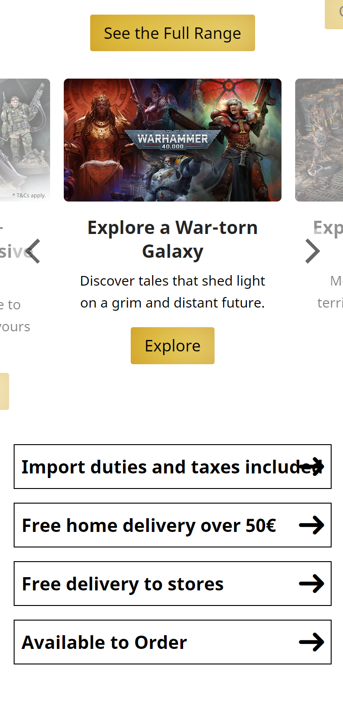

# Procesverslag
Markdown is een simpele manier om HTML te schrijven.  
Markdown cheat cheet: [Hulp bij het schrijven van Markdown](https://github.com/adam-p/markdown-here/wiki/Markdown-Cheatsheet).

Nb. De standaardstructuur en de spartaanse opmaak van de README.md zijn helemaal prima. Het gaat om de inhoud van je procesverslag. Besteedt de tijd voor pracht en praal aan je website.

Nb. Door *open* toe te voegen aan een *details* element kun je deze standaard open zetten. Fijn om dat steeds voor de relevante stuk(ken) te doen.

## Jij

  
uitwerken voor kick-off werkgroep

  ### Auteur:
  Jan de Munnik

  #### Je startniveau:
  Blauw

  #### Je focus:
  Responsive
 

## Je website

  
uitwerken voor kick-off werkgroep

  ### Je opdracht:
  https://www.games-workshop.com/en-NL/Home

  #### Screenshot(s) van de eerste pagina (small screen): 
  home pagina
  
  
  
  

  #### Screenshot(s) van de tweede pagina (small screen):
  age of sigmar pagina
  
  
  
  
 

<!-- TODO fixen papier! -->
## Toegankelijkheidstest 1/2 (week 1)

  
uitwerken na test in 2e werkgroep

  ### Bevindingen
  Lijst met je bevindingen die in de test naar voren kwamen: Begint met de h1 dat de heading is van de eerste advertentie
  gaat daarna gelijk alle h4's opnoemen wat alle nieuws articelen en producten zijn
  de images hebben geen alt text
  het html document is niet gevalideert
  de focus stijl is erg onduidelijk
  als het scherm te klein is kan je horizontaal scrollen
  ze hebben geen dark mode
  

/ TODO!!!!!! /

## Breakdownschets (week 1)

  
uitwerken na afloop 3e werkgroep

  ### de hele pagina: 
  
  
  
  

  ### dynamisch deel (bijv menu): 
  

  ### wellicht nog een dynamisch deel (bijv filter): 
  

## Voortgang 1 (week 2)

  
uitwerken voor 1e voortgang

  ### Stand van zaken
  hier dit ging goed & dit was lastig (neem ook screenshots op van delen van je website en code)
  Goed: Indelen van de site met html en css ging best goed.
  Lastig: Github moest wel beter geregeld worden want die werkte nu niet. En het scherm was te breed sommige delen staken helaas uit voor bijv de header. Dit was doordat mijn linkjes naast elkaar stonden die moet ik onder elkaar verdelen.
  

  ### Agenda voor meeting
  samen met je groepje opstellen

  | student 1  
  praten over grids en hoe het mogelijk in de website stijl zou kunnen passen
  | student 2          
  praten over grids en flexbox
  | student 3    
  vragen wat we allemaal voor sparkel kunnen toevoegen
  | student 4       
   kijken wat er verwacht word voor responsive design

  ### Verslag van meeting
  hier na afloop snel de uitkomsten van de meeting vastleggen

  - punt 1
  - Ik weet nu wat er verwacht word voor responsive design niet alleen dat het goed scalebaar is maar ook dat interface kan verranderen
  - punt 2
  - sections moeten een header hebben voor screenreader toegankelijkheid
  - nog een punt
  - ik moet de header aanpassen zodat er geen onodige witruimte is aan de rechterkant 

## Voortgang 2 (week 3)

  
uitwerken voor 2e voortgang

  ### Stand van zaken
  hier dit ging goed & dit was lastig (neem ook screenshots op van delen van je website en code)
  Goed: Ik had de witruimte op mijn scherm kunnen fixen
  Lastig: Ik moet nogsteeds even mijn Github fixen. Ik moet ook mn email input in een label zetten

  ### Agenda voor meeting
  samen met je groepje opstellen

  | student 1   
  Is het handig om darkmode toe te voegen? ookal zijn de images wit?   
  | student 2       
  Hoe haal ik mapjes uit mijn github of hoe verplaats ik die?   
  | student 3    
  Hoe zet ik labels in mijn html fixen?
  | student 4        
   

  ### Verslag van meeting
  hier na afloop snel de uitkomsten van de meeting vastleggen

  - punt 1
  mijn github regelen via student assistenten
  - punt 2
  zelf ook een label gebruiken voor mijn email input
  - nog een punt
  tweede scherm maken
- ...

## Toegankelijkheidstest 2/2 (week 4)

  
uitwerken na test in 9e werkgroep

  ### Bevindingen
  ik had nog geen dark mode
  ik had nog niet overal alt text voor geschreven
  ook waren niet alle teksten voor mijn buttons verschillend
  Dit heb ik allemaal toegevoegd

## Voortgang 3 (week 4)

  
uitwerken voor 3e voortgang

  ### Stand van zaken
  hier dit ging goed & dit was lastig (neem ook screenshots op van delen van je website en code)
  Goed: beide schermen deden het en het tabben door de site werkte goed alleen kon ik het niet visueel zien bij sommige knoppen
  Lastig: Het regelen van tabben door sommige knoppen. Responsive maken van mijn site.

  ### Agenda voor meeting
  samen met je groepje opstellen

  | student 1   
  Hoe regel ik darkmode voor mijn website?
  | student 2       
  Zit mijn website voor nu goed in elkaar en wat zou ik mogelijk nog kunnen toevoegen
  | student 3    
  was er niet
  | student 4  
  was er niet

  ### Verslag van meeting
  hier na afloop snel de uitkomsten van de meeting vastleggen

  - punt 1
  responsive maken van mijn site
  - punt 2
  github bij gaan houden
  - nog een punt
  darkmode toevoegen

## Eindgesprek (week 5)

  
uitwerken voor eindgesprek

  ### Je uitkomst - karakteristiek screenshots:
  
  
  
  
  

  ### Dit ging goed/Heb ik geleerd: 
  Ik weet hoe ik bepaalde punten in mijn website responsive kan maken.
  
  
  Ik weet hoe ik darkmode kan toevoegen.
  
  Ik weet hoe een screenreader nu werkt.
  Ik weet hoe ik een toegankelijkheidstest werkt.

  ### Dit was lastig/Is niet gelukt:
  Het was me helaas niet gelukt om nog binnen de tijd mijn navigatie menu responsive te maken.
  
  Ik wou misschien ook de refine knop links uitlijnen maar dat was me helaas ook niet gelukt toen ik eraan was begonnen maakte ik mijn hele website helaas stuk.
  

## Bronnenlijst

  
continu bijhouden terwijl je werkt

  Nb. Wees specifiek ('css-tricks' als bron is bijv. niet specifiek genoeg). 
  Nb. ChatGpT en andere AI horen er ook bij.
  Nb. Vermeld de bronnen ook in je code.

  1. Hamburger Icon: Call 610 - 465 - - White Hamburger Menu Icon PNG - (1168x1084) pNg clipart download. ClipartMax.com. (n.d.). ClipartMax.com. https://www.clipartmax.com/max/m2i8G6G6b1m2A0G6/
  2. Search icon: Icons, E. (n.d.). "search" Icon - Download for free – Iconduck. Iconduck. https://iconduck.com/icons/103959/search
  3. Language dutch icon: Yakovenko, O. (2022). Download the Flag of Netherlands. Symbol of Independence Day, souvenir soccer game, button language, icon. 12. . .. Vecteezy. https://www.vecteezy.com/vector-art/12693880-flag-of-netherlands-symbol-of-independence-day-souvenir-soccer-game-button-language-icon
  4. Warhammer community icon: Home - Warhammer Community. (2023, September 13). Warhammer Community. https://www.warhammer-community.com/
  5. Phone icon: phone - IconsPlace. (2018, July 19). IconsPlace. https://iconsplace.com/white-icons/phone-icon-18/
  6. speech bubble icon: Xinh Studio. (2014, May 24). speech-bubbles. The Noun Project. https://thenounproject.com/icon/speech-bubbles-51907/
  7. promotional art aos: Harrison, A. (2021). AOS: Ironjawz Faction Focus – Vanguard of Destruction. Bell of Lost Souls. https://www.belloflostsouls.net/2018/05/aos-ironjawz-faction-focus-vanguard-of-destruction.html

