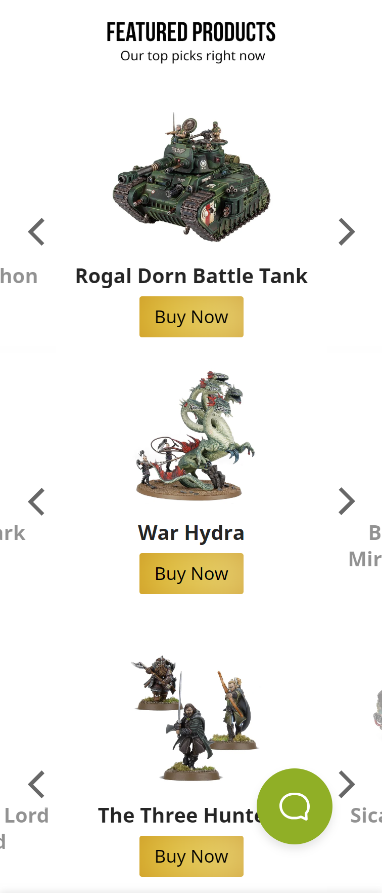

# Procesverslag
Markdown is een simpele manier om HTML te schrijven.  
Markdown cheat cheet: [Hulp bij het schrijven van Markdown](https://github.com/adam-p/markdown-here/wiki/Markdown-Cheatsheet).

Nb. De standaardstructuur en de spartaanse opmaak van de README.md zijn helemaal prima. Het gaat om de inhoud van je procesverslag. Besteedt de tijd voor pracht en praal aan je website.

Nb. Door *open* toe te voegen aan een *details* element kun je deze standaard open zetten. Fijn om dat steeds voor de relevante stuk(ken) te doen.

## Jij

  
uitwerken voor kick-off werkgroep

  ### Auteur:
  Sanne 't Hooft (vervangen door jouw naam)

  #### Je startniveau:
  hier je startniveau Blauw

  #### Je focus:
  hier je focus Responsive
 

## Je website

  
uitwerken voor kick-off werkgroep

  ### Je opdracht:
  https://www.games-workshop.com/en-NL/Home

  #### Screenshot(s) van de eerste pagina (small screen): 
  home pagina
  
  
  
  

  #### Screenshot(s) van de tweede pagina (small screen):
  age of sigmar pagina
  
  
  
  
 

## Toegankelijkheidstest 1/2 (week 1)

  
uitwerken na test in 2e werkgroep

  ### Bevindingen
  Lijst met je bevindingen die in de test naar voren kwamen:
  

/ TODO!!!!!! /

## Breakdownschets (week 1)

  
uitwerken na afloop 3e werkgroep

  ### de hele pagina: 
  

  ### dynamisch deel (bijv menu): 
  

  ### wellicht nog een dynamisch deel (bijv filter): 
  

## Voortgang 1 (week 2)

  
uitwerken voor 1e voortgang

  ### Stand van zaken
  hier dit ging goed & dit was lastig (neem ook screenshots op van delen van je website en code)
  

  ### Agenda voor meeting
  samen met je groepje opstellen

  | student 1  
  praten over grids en hoe het mogelijk in de website stijl zou kunnen passen
  | student 2          
  praten over grids en flexbox
  | student 3    
  vragen wat we allemaal voor sparkel kunnen toevoegen
  | student 4       
   kijken wat er verwacht word voor responsive design

  ### Verslag van meeting
  hier na afloop snel de uitkomsten van de meeting vastleggen

  - punt 1
  - Ik weet nu wat er verwacht word voor responsive design niet alleen dat het goed scalebaar is maar ook dat interface kan verranderen
  - punt 2
  - sections moeten een header hebben voor screenreader toegankelijkheid
  - nog een punt
  - ik moet de header aanpassen zodat er geen onodige witruimte is aan de rechterkant 

## Voortgang 2 (week 3)

  
uitwerken voor 2e voortgang

  ### Stand van zaken
  hier dit ging goed & dit was lastig (neem ook screenshots op van delen van je website en code)

  ### Agenda voor meeting
  samen met je groepje opstellen

  | student 1      | student 2          | student 3    | student 4        |
  | ---            | ---                | ---          | ---              |
  | dit bespreken  | en dit             | en ik dit    | en dan ik dat    |
  | en dat ook nog | dit als er tijd is | nog een punt | dit wil ik zeker |
  | ...            | ...                | ...          | ...              |

  ### Verslag van meeting
  hier na afloop snel de uitkomsten van de meeting vastleggen

  - punt 1
  - punt 2
  - nog een punt
- ...

## Toegankelijkheidstest 2/2 (week 4)

  
uitwerken na test in 9e werkgroep

  ### Bevindingen
  Lijst met je bevindingen die in de test naar voren kwamen (geef ook aan wat er verbeterd is):

## Voortgang 3 (week 4)

  
uitwerken voor 3e voortgang

  ### Stand van zaken
  hier dit ging goed & dit was lastig (neem ook screenshots op van delen van je website en code)

  ### Agenda voor meeting
  samen met je groepje opstellen

  | student 1      | student 2          | student 3    | student 4        |
  | ---            | ---                | ---          | ---              |
  | dit bespreken  | en dit             | en ik dit    | en dan ik dat    |
  | en dat ook nog | dit als er tijd is | nog een punt | dit wil ik zeker |
  | ...            | ...                | ...          | ...              |

  ### Verslag van meeting
  hier na afloop snel de uitkomsten van de meeting vastleggen

  - punt 1
  - punt 2
  - nog een punt
  - ...

## Eindgesprek (week 5)

  
uitwerken voor eindgesprek

  ### Je uitkomst - karakteristiek screenshots:
  

  ### Dit ging goed/Heb ik geleerd: 
  Korte omschrijving met plaatjes

  

  ### Dit was lastig/Is niet gelukt:
  Korte omschrijving met plaatjes

  

## Bronnenlijst

  
continu bijhouden terwijl je werkt

  Nb. Wees specifiek ('css-tricks' als bron is bijv. niet specifiek genoeg). 
  Nb. ChatGpT en andere AI horen er ook bij.
  Nb. Vermeld de bronnen ook in je code.

  1. Hamburger Icon: Call 610 - 465 - - White Hamburger Menu Icon PNG - (1168x1084) pNg clipart download. ClipartMax.com. (n.d.). ClipartMax.com. https://www.clipartmax.com/max/m2i8G6G6b1m2A0G6/
  2. Search icon: Icons, E. (n.d.). "search" Icon - Download for free – Iconduck. Iconduck. https://iconduck.com/icons/103959/search
  3. Language dutch icon: Yakovenko, O. (2022). Download the Flag of Netherlands. Symbol of Independence Day, souvenir soccer game, button language, icon. 12. . .. Vecteezy. https://www.vecteezy.com/vector-art/12693880-flag-of-netherlands-symbol-of-independence-day-souvenir-soccer-game-button-language-icon
  4. Warhammer community icon: Home - Warhammer Community. (2023, September 13). Warhammer Community. https://www.warhammer-community.com/
  5. Phone icon: phone - IconsPlace. (2018, July 19). IconsPlace. https://iconsplace.com/white-icons/phone-icon-18/
  6. speech bubble icon: Xinh Studio. (2014, May 24). speech-bubbles. The Noun Project. https://thenounproject.com/icon/speech-bubbles-51907/
  7. promotional art aos: Harrison, A. (2021). AOS: Ironjawz Faction Focus – Vanguard of Destruction. Bell of Lost Souls. https://www.belloflostsouls.net/2018/05/aos-ironjawz-faction-focus-vanguard-of-destruction.html

